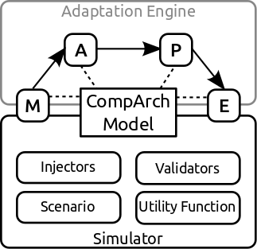

## Quick guide
 * [Install mRUBiS](https://github.com/thomas-vogel/mRUBiS/wiki/Install-mRUBiS)
 * [Experiment with the example solutions built on top of mRUBiS for self-healing and self-optimization](https://github.com/thomas-vogel/mRUBiS/wiki/Example-Solutions). These examples use the exemplar's simulator as described [here](https://github.com/thomas-vogel/mRUBiS/wiki/Using-the-Simulator).
 * Details can be found below and in the [Wiki](https://github.com/thomas-vogel/mRUBiS/wiki).

## --

mRUBiS is an exemplar for self-adaptive software, particularly for developing, evaluating, and comparing adaptation engines that perform model-based architectural self-adaptation.

## Motivation
Self-adaptive software systems are often structured into an adaptation engine that manages an adaptable software by operating on a runtime model that represents the architecture of the software (_model-based architectural self-adaptation_). Despite the popularity of such approaches, existing exemplars provide application programming interfaces but no runtime model to develop adaptation engines. Consequently, there does not exist any exemplar that supports developing, evaluating, an comparing model-based self-adaptation off the shelf. For this purpose, we present _mRUBiS_.

## Overview
mRUBiS is an extensible exemplar for model-based architectural self-healing and self-optimization. It simulates the mRUBiS marketplace as the adaptable software and therefore provides and maintains an architectural runtime model of the software. This model can be directly used by adaptation engines to realize and perform self-adaptation.

Particularly, mRUBiS supports injecting issues into the model, which should be handled by self-adaptation, and validating the model to assess the self-adaptation. mRUBiS allows developers to explore variants of adaptation engines (e.g., event-driven self-adaptation similar to event-condition-action rules) and to evaluate the effectiveness, efficiency, and scalability of self-adaptation. Finally, developers can use their favorite technologies to implement the adaptation engines such as pure code or even model-driven techniques (e.g., [OCL](https://projects.eclipse.org/projects/modeling.mdt.ocl), [Story Diagrams](https://projects.eclipse.org/projects/modeling.mdt.ocl), [Henshin](https://www.eclipse.org/henshin/) etc.) that operate on the architectural runtime model.

The architectural runtime model is expressed by the _CompArch_ language, for which we provide a modeling editor. The language is based on the [Eclipse Modeling Framework (EMF)](https://www.eclipse.org/modeling/emf/) so that the technologies used to implement the adaptation engine must be compatible with EMF.

mRUBiS is extensible. Developers can implement their individual
_scenarios_ to specify the simulation,
_injectors_ to inject issues into the model,
_validators_ to validiate the model after a self-adaptation, and
_utility functions_ to compute the utility of the adaptable software based on the CompArch model. Since the CompArch language and the core simulator is independent of the specific system, they even allow developers to specify other component-based software than mRUBiS.

## Installing mRUBiS
mRUBiS has been developed as an Eclipse plug-in. Use the [Eclipse Oxygen.2 (4.7.2) Release with the Eclipse Modeling Tools package](http://www.eclipse.org/downloads/packages/eclipse-modeling-tools/oxygen2) and install the mRUBiS plug-in using the following Eclipse update site:

[`https://thomas-vogel.github.io/mRUBiS/`](https://thomas-vogel.github.io/mRUBiS/)

mRUBiS has been developed and tested on Ubuntu 16.04, only basic tests have been made with Windows.

## More information
A detailed description of the mRUBiS exemplar, the CompArch language, modeling editor, and the use of the exemplar can be found in the [Wiki](https://github.com/thomas-vogel/mRUBiS/wiki).

## Relation to mRUBiS-EJB3
While this exemplar simulates mRUBiS as the adaptable software to have a light-weight environment for experimenting with model-based self-adaptation solutions, there exists a real prototype of mRUBiS.
This prototype is implemented with EJB3 technology and can be deployed to the GlassFish application server. The prototype is called [_mRUBiS-EJB3_](https://github.com/thomas-vogel/mRUBiS-EJB3).
